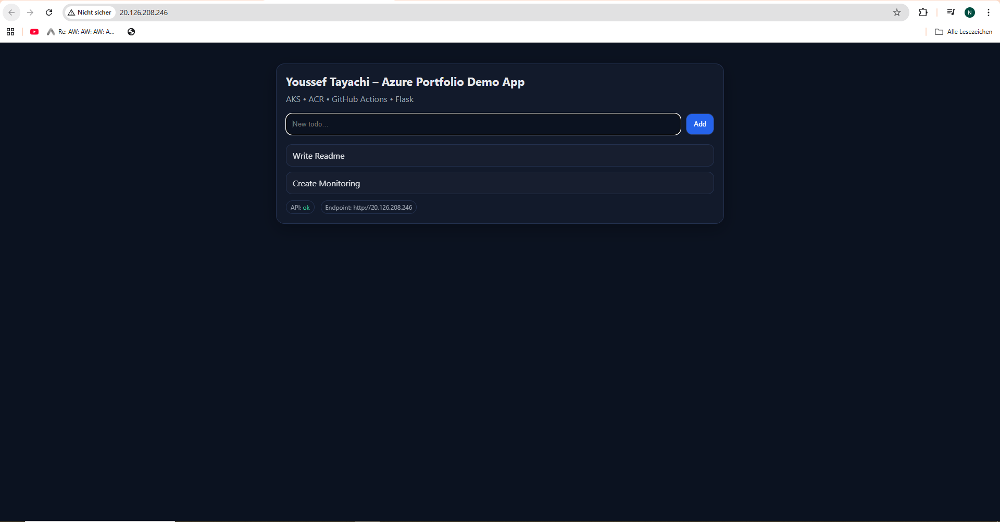
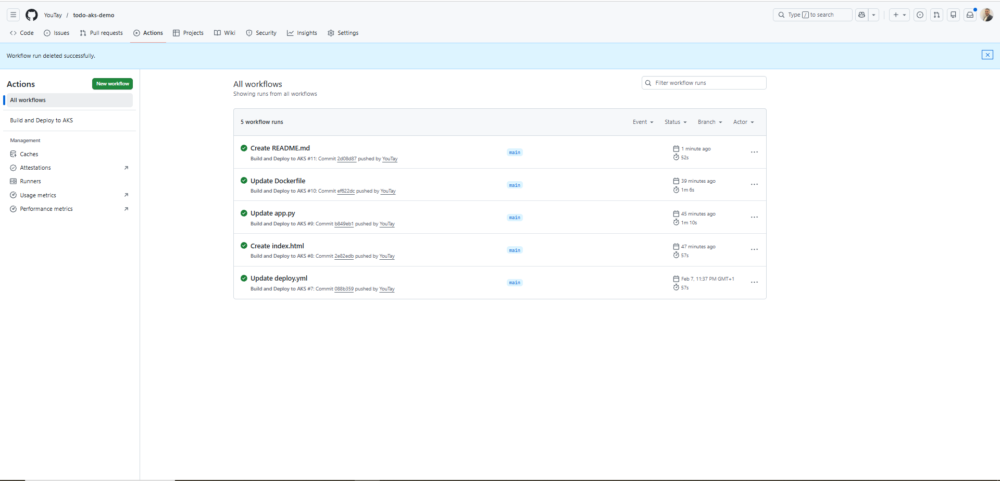
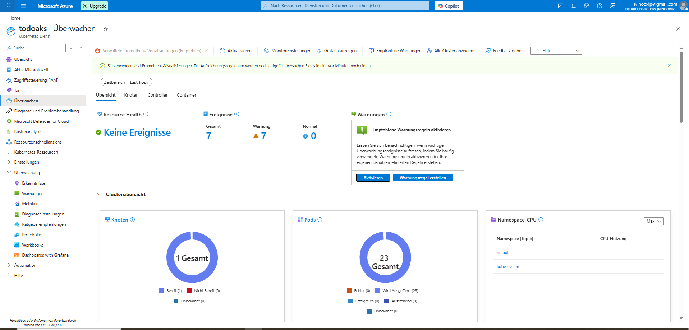

# Azure AKS Portfolio Project

## Cloud-Native Todo Application on Microsoft Azure

This project demonstrates an end-to-end Azure cloud deployment using Kubernetes, containerization, CI/CD automation, and monitoring.
Focus: **Azure operations + DevOps workflow**, not app complexity.

---

## Application

A lightweight **Python Flask** Todo API with a simple browser UI.

**Endpoints**

* `GET /health` – health check
* `GET /todos` – list todos
* `POST /todos` – add todo

### Application UI

---

## CI/CD Pipeline (GitHub Actions)

Pipeline on every push to `main`:

1. Build container image
2. Push image to **Azure Container Registry (ACR)**
3. Deploy to **Azure Kubernetes Service (AKS)** using `kubectl`

### GitHub Actions Pipeline

---

## Kubernetes Deployment (AKS)

AKS runs the workload as Kubernetes resources:

* **Deployment** (`todo-api`)
* **Service (LoadBalancer)** exposing the app publicly
* Rolling updates triggered via CI/CD

### AKS Workloads View

---

## Monitoring & Observability

Operational visibility via **Azure Monitor / Container Insights**:

* Node + pod metrics
* Cluster health and events
* Centralized logging (Log Analytics workspace)

### Monitoring Overview

---

## Architecture Flow

**GitHub → GitHub Actions → ACR → AKS → Public LoadBalancer IP → Azure Monitor**

---

## Skills Demonstrated

**Azure**

* AKS (cluster operations, workloads, services)
* ACR (container registry integration)
* Azure Monitor / Log Analytics (observability)

**DevOps**

* GitHub Actions CI/CD
* Automated build + deploy pipeline for Kubernetes

**Kubernetes**

* Deployments, Services, rolling updates
* Basic operational troubleshooting via logs/metrics

---

## Author

**Youssef Tayachi**
Azure / Cloud Engineering Portfolio Project
